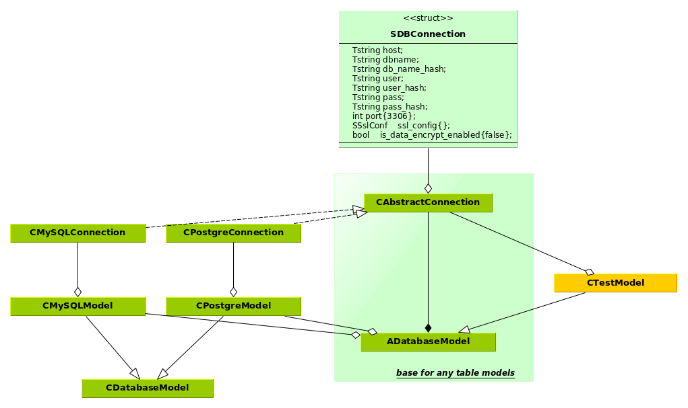
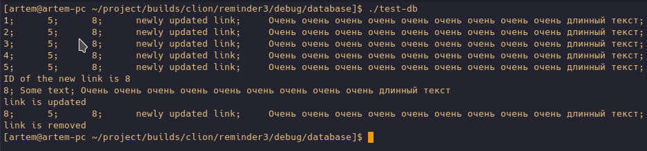
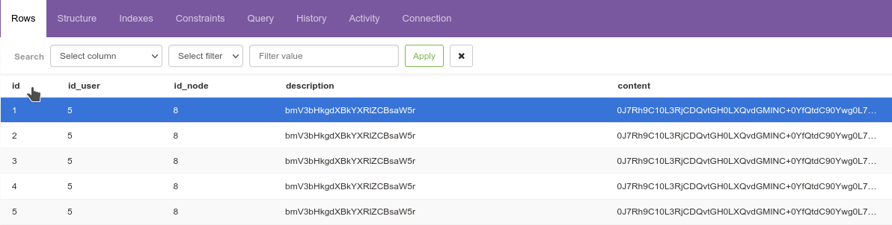

# lib-database
It supports work with DBMS `Maria-DB`/`MySQL`, `PostgreSQL' with the ability to encrypt text fields.

## Current status:
The library has been verified to work with MySQL without/with SSL support
Finish it:
    working with PostgreSQL with SSL connection support

Checking the library's operation is to open a separate CMake project in the `database` folder in the [`main.cpp `](main.cpp )
the `add`/`get`/`update`/`remove` methods for database entries were demonstrated, for which a test model
of the table [`CTestModel`] was created (CTestModel.h)

Execution result:

DB table content (postgres)

